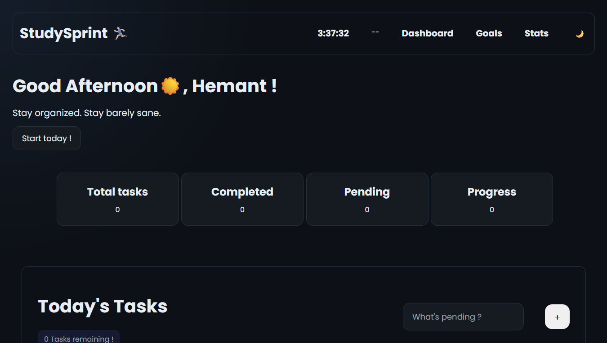
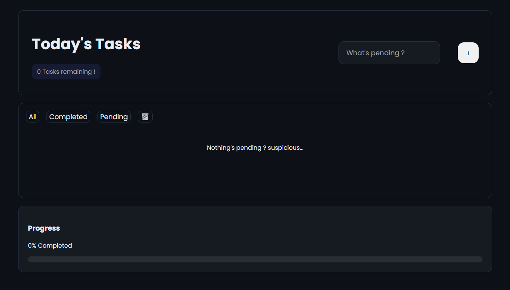
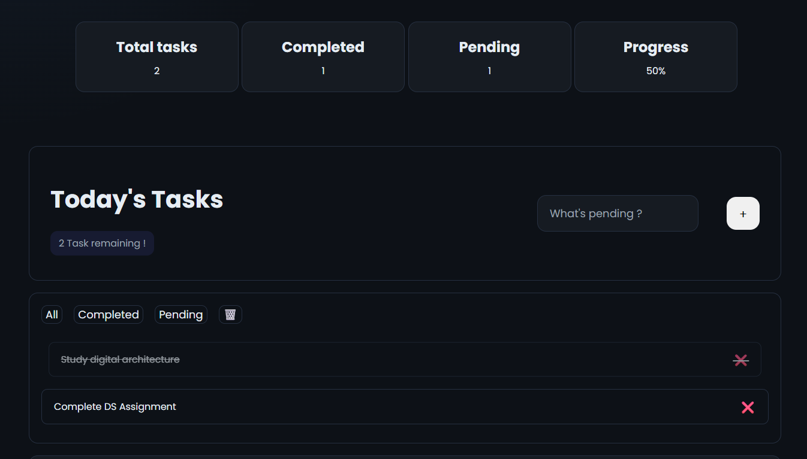
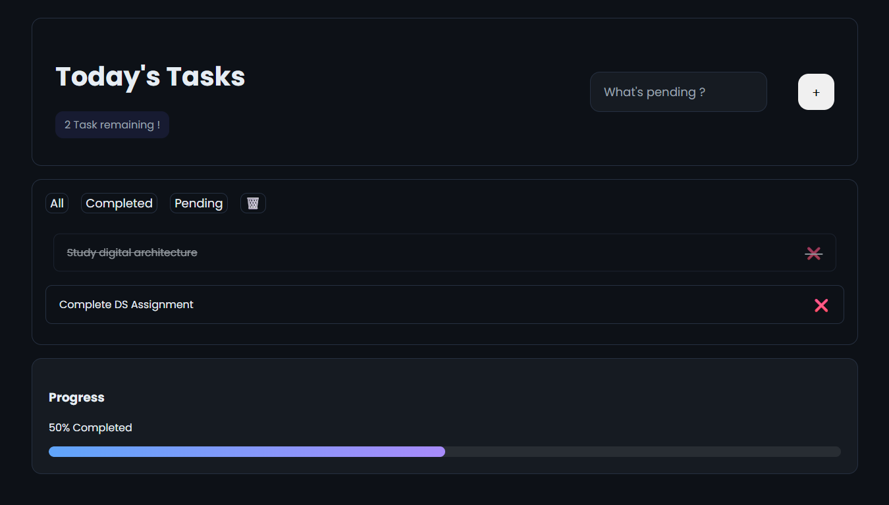
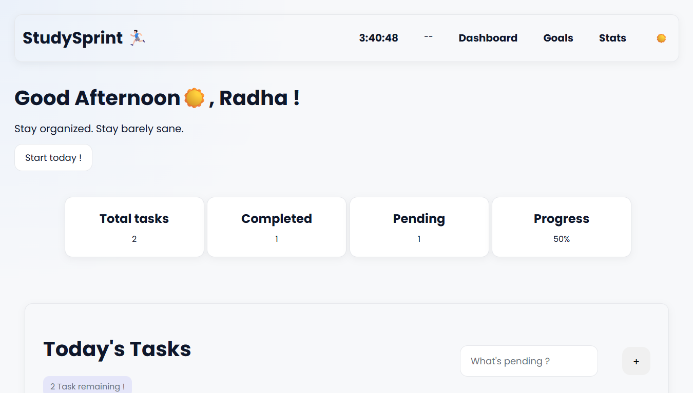
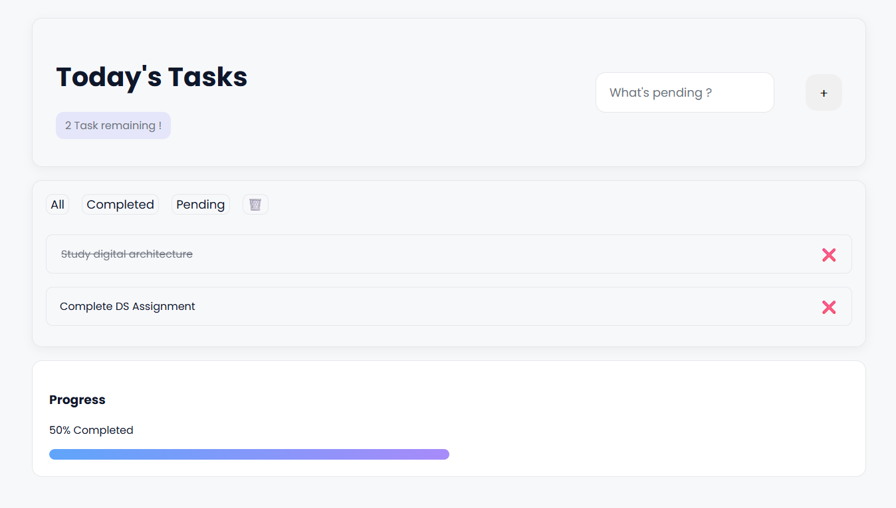

# StudySprint

StudySprint is a modern productivity dashboard built using HTML, CSS and Vanilla JavaScript.

It helps users manage daily tasks with a clean responsive interface, progress tracking and persistent local storage.

---

## 🚀 Features

- ✅ Add and delete tasks
- ✅ Mark tasks as completed
- ✅ Persistent local storage
- ✅ Responsive mobile-friendly UI
- ✅ Dark / Light mode
- ✅ Progress tracking
- ✅ Dynamic stats cards
- ✅ Filter tasks (All / Completed / Pending)
- ✅ Keyboard support
- ✅ Clear all tasks option

---

## 🛠 Technologies Used

- HTML5
- CSS3
- JavaScript
- Git & GitHub

---

## 🌐 Live Demo

[StudySprint Live](https://hmntsriv.github.io/StudySprint/)

---

## 📸 Screenshots

---

## 📚 What I Learned

Through this project I learned:

- DOM Manipulation
- Local Storage
- State Management
- Responsive Design
- Git & GitHub workflow
- UI/UX polishing
- Refactoring and debugging

---

## 👨‍💻 Author

Hemant Srivastava